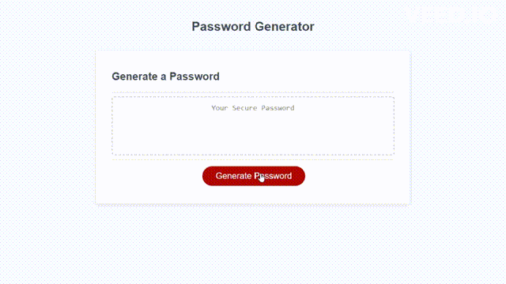
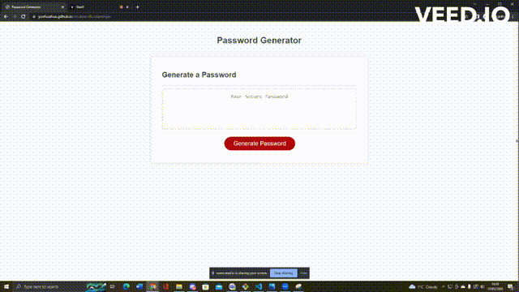
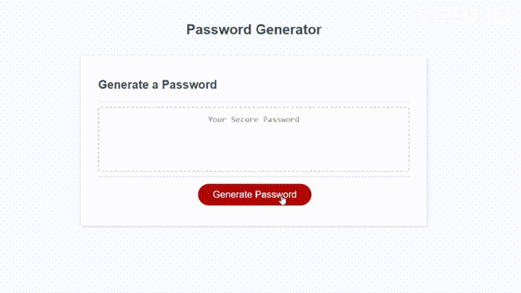
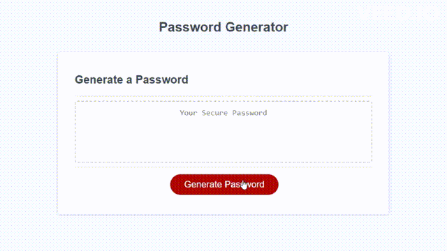
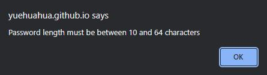
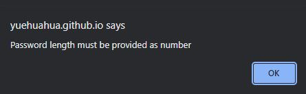

# Module 5 Challenge: Password Generator

  

</br>

## Table of Contents
* [Description](#description)
* [Features](#features)
* [Installation & Deployment](#installation-and-deployment)
* [How to Use](#how-to-use)
* [License](#license)

</br>

## Overview

This challenge presents a real-world situation in which the newfound JavaScript skills will come in handy. The code has been built to generate a random password based on criteria they've been selected. This includes length of the password, and character types (lowercased, uppercased, numeric, and [special characters](https://www.owasp.org/index.php/Password_special_characters)). The application can be run in the browser and has been designed to adapt to multiple screen sizes.



</br>

## Features

This application works by taking several inputs from users which are password length and the character types that the users wish to include. There are requirements that need to follow to generate the password which will be described in the following sections. Moreover, The application User Interface (UI) also has been designed to be responsive so it can work in various screen sizes.

</br>

### Responsive UI
This application offers a responsive User Interface (UI) that adapts to multiple screen sizes which can be seen on following gif.



</br>

### Password Criteria
Once the "Generate Password" button is clicked, a user will be presented a series of prompts for password criteria. This includes the length of the password and the character types that the user wish to include. Based on the chosen criteria, the password will be generated.

</br>

#### a. Password Length
After clicking the button, password length prompt appears first. The user is required to answer this section by inputting a number. The length of password should be at least 10 characters but no more than 64. 



</br>

#### b. Password Character Type Options
Once the length of password is defined, a series of prompt asking for character type appears next. Here, the user can selects the character types by selecting `OK` for yes and `Cancel` for no. The available characters are lowercase, uppercase, numeric, and [special characters](https://www.owasp.org/index.php/Password_special_characters). It is important to choose at least one type of character. Finally, the password will be generated once users selecting all criteria options.



</br>

### Error Handling
As mentioned before, there are few rules that need to follow. The application should not accept any password length less than 10 and longer than 64. Hence, an alert box appears whenever users input an incorrect number.



</br>

As the application should not continue unless the users input a correct value. A `return` is used in this logic code.
  ```javascript
  if(length < 10 || length > 64){
    alert(`Password length must be between 10 and 64 characters`);
    return;
  }
  ```

</br>

However, as  `return` means jumping out from the `getPasswordOptions()` function, this leads to errors as `generatePassword()` cannot call several methods in `getPasswordOptions()` function. Hence, `try{}` and `catch{}` methods are used in `generatePassword()` to tackle the errors. The `Incorrect Input :(` error alert can be seen in web console tab.

  ```javascript
  function generatePassword() {
    try { ... }
    catch(err){
      console.log("Incorrect Input :(");
      return;
    }
  }
  ```

  </br>

Another rule is the length of password input cannot be anything other than a number. Hence, another alert box also appears whenever users input an incorrect type.



</br>

Similar to the previous case, the application should not continue unless the users insert a correct input type and `return` is also used here.

  ```javascript
  if(isNaN(length) === true){
    alert(`Password length must be provided as number`);
    return;
  }
  ```

</br>

This also leads to the same errors as in the previous case. Hence, the solution of using `try{}` and `catch{}` has answered these errors caused by this code as well.

</br>

## Installation and Deployment

Installation not required, since this is a "plug and play" type of application. The user can simply run it locally by clicking on the `index.html` file and opening in either their default or preferred browser.

Application can also be accessed at following links:
* [GitHub repository](https://github.com/YueHuaHua/module-05-challenge).
* [Deployed application](https://yuehuahua.github.io/module-05-challenge/).

</br>

## How to Use 

* Click the `Generate Password` red button
* Input a number between 10 and 64 as the length of password and click `OK`
* Click `OK` for each character type option that you wish to include in the password
* Get and copy the randomly generated password

</br>

## License

Licensed under the [MIT license](https://github.com/git/git-scm.com/blob/main/MIT-LICENSE.txt). See LICENSE for the full details.
